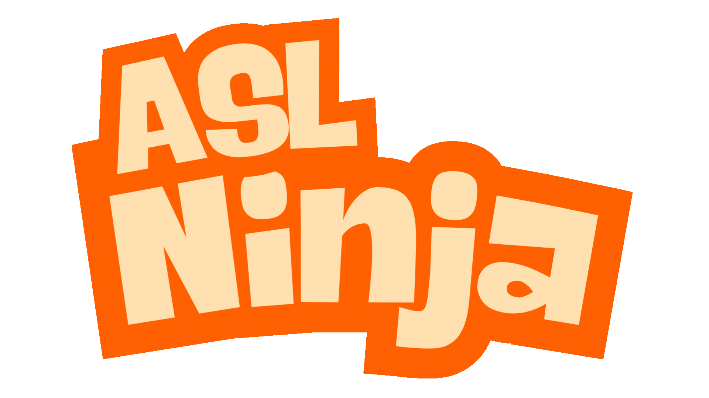

# ASL Ninja

Check out the project on [Devpost]()

[Try it out!](https://aslninja.gradientascent.net/)

## Inspiration
American Sign Language (ASL) is one of America's most significant languages, with over a million native users worldwide, and its influence has spread to various regions, including Singapore. In fact, according to the World Health Organization (WHO), more than 1.5 billion people worldwide experience some degree of hearing impairment. Take Singapore as an example, research has showed that about 1 of every 1,000 babies born in Singapore have severe or profound hearing loss, and about 5 of every 1,000 have lesser degrees of hearing loss. Learning this method of communication is not only essential for fostering inclusivity and understanding but can also be engaging and enjoyable. The concept of gamification has proven both fascinating and effective as a teaching tool, serving as a powerful way to help people of all ages learn the language. Therefore, we aim to raise awareness about hearing impairment through an engaging and interactive approach.

## What it does
The app serves as a platform for learning American Sign Language in a fun and interactive way. Players use hand gestures to match the alphabet displayed on the screen, with machine learning capturing and detecting the gestures to identify the corresponding letters. Correct gestures earn points, and players can compete on a friendly leaderboard. The app also includes a practice mode for skill-building and offers different difficulty levels to enhance the challenge. By combining learning with friendly competition, the app promotes inclusivity and raises awareness about communication with individuals who have hearing loss.

## How we built it
We primarily used TensorFlow.js in our project, specifically the Handpose module, to capture and identify hand poses. This module detects finger curls and directions, enabling the recognition of ASL letters. TensorFlow.js was ideal for our use case as it operates efficiently within web browsers. We built the web app using React and styled it with Tailwind CSS to ensure a visually appealing and responsive design. Additionally, we utilized p5.js to create animations and movements, enhancing the app's visual appeal. For user authentication and leaderboard score storage, we integrated Google Firebase, which allowed us to track each user's scores and provide detailed statistics, such as confidence levels for each pose.

## Challenges we ran into
We encountered several challenges during development. First, configuring TensorFlow.js proved to be a complex task, requiring significant troubleshooting and fine-tuning. Second, creating smooth slicing animations was particularly difficult, as achieving a seamless and visually appealing effect demanded careful adjustments. Lastly, we faced latency issues when running the application on our machines, which required optimizing performance to enhance the user experience. Fortunately, we were able to overcome these challenges last minute through debugging and switching it to a GPU-enabled laptop.

## Accomplishments that we're proud of
We are particularly proud of our collaboration and efficiency in creating the app from scratch within a short timeframe. This includes not only developing the core functionality but also designing and creating assets such as the alphabet visuals and logos.

## What we learned
Apart from raising our own awareness about the growing number of people experiencing hearing loss and recognizing sign language as an increasingly important communication method that fosters inclusivity and understanding, we also gained significant technical benefits. Specifically, the p5.js framework for creating animations and movements, as well as TensorFlow.js for gesture detection. Additionally, we deepened our knowledge of Firebase and Next.js, further enhancing our skills in modern web development.

## What's next for ASL Ninja
We plan to extend our gesture recognition modules from 26 alphabets to more commonly used words and phrases. We also plan to add more engaging features to the game to enable multiplayer matchmaking and a competitive gameplay.